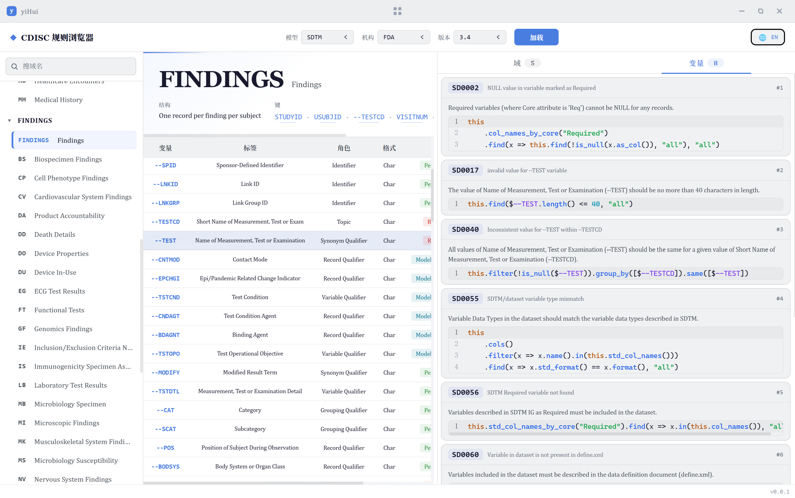
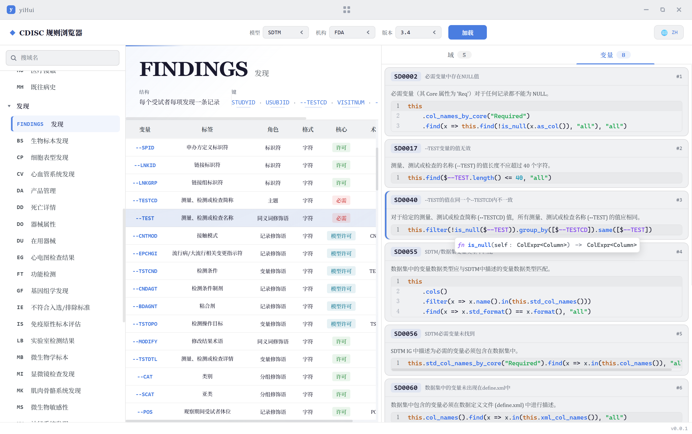

# 医烩 yiHui

> CDISC 标准浏览与规则校验桌面应用

医烩（yiHui）是一款面向 CDISC 标准（SDTM / ADaM 等）的本地桌面工具，用于浏览标准结构、查看变量元数据，并基于内置规则对研究数据进行校验。前端采用 Tauri 2 + Svelte 5，后端基于 Rust，规则引擎使用 Polars。

## 软件截图

  
   

  
   

## 功能特性

- **标准浏览**：按模型 / 机构 / 版本加载并浏览 CDISC 校验规则标准。
- **结构查看**：查看 Domain 结构、变量元数据及其关联规则。
- **DSL 编辑器**：内置特定领域语言编辑器，支持语法高亮、实时诊断与悬停提示（未提供函数文档）。
- **数据校验**：未开放。
- **多语言界面**：支持中文 / 英文界面与数据语言切换。

## 技术栈

| 层级 | 技术 |
| --- | --- |
| 前端 | Tauri 2、Svelte 5 |
| 后端 | Rust |
| 规则引擎 | Polars（数据处理与校验执行） |
| 规则描述 | 项目自定义特定领域语言（DSL） |

## 下载与运行

本软件以**可执行文件（exe）形式分发**。分发内容为一个文件夹，包含：

- `yiHui.exe` —— 主程序
- `resources/` —— 资源目录（**必须与 exe 位于同一目录**）

运行步骤：

1. 将整个文件夹解压 / 拷贝到本地；
2. 确保 `yiHui.exe` 与 `resources/` 处于同一目录；
3. 双击 `yiHui.exe` 启动，无需安装。

> ⚠️ 请勿单独移动 `yiHui.exe`；缺失 `resources/` 将导致标准数据无法加载、界面选项为空。

## 系统要求

- Windows 10 / 11（64 位）
- Microsoft Edge WebView2（多数系统已预装；缺失时会导致运行失败）
- 约 60 MB 可用磁盘空间

## 重要声明

本软件内置规则与 CDISC 标准相关的数据**仅供参考，不构成任何官方或合规依据**。关于规则归属、表达式性质、实现局限与免责条款，请务必阅读 [免责声明](./DISCLAIMER.md)。

## 许可证

本软件为闭源专有软件，仅授权个人 / 内部使用，禁止反编译与二次分发。

## 版本

当前版本：v0.0.1
